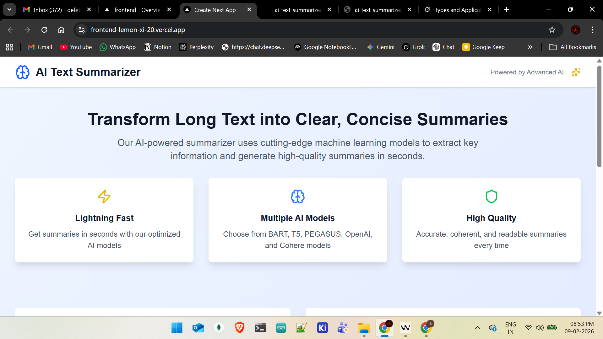
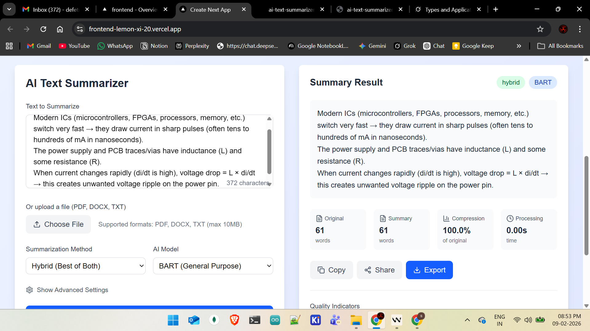

<div align="center">

# 🧠 AI Text Summarizer

### Transform Long Text into Clear, Concise Summaries

[](https://frontend-lemon-xi-20.vercel.app)
[](https://ai-text-summarizer-c3nb.onrender.com)
[](https://python.org)
[](https://nextjs.org)
[](https://fastapi.tiangolo.com)
[](https://typescriptlang.org)
[](https://tailwindcss.com)
[](LICENSE)

An advanced AI-powered text summarization application built with **Next.js** frontend and **FastAPI** backend. Supports multiple AI models, file uploads, and various export formats.

</div>

---

## 📸 Screenshots

### Homepage


### Summarization in Action


---

## ✨ Features

### 🚀 Core Functionality
- **Multiple AI Models** — BART, T5, PEGASUS, OpenAI GPT, Cohere
- **Summarization Methods** — Extractive, Abstractive, and Hybrid approaches
- **File Support** — PDF, DOCX, TXT file uploads with text extraction
- **Export Options** — PDF, DOCX, TXT, CSV formats
- **Real-time Processing** — Fast and efficient text processing

### 🎨 User Experience
- **Modern UI** — Clean, responsive interface built with Tailwind CSS
- **Interactive Dashboard** — Real-time statistics and quality indicators
- **Batch Processing** — Summarize multiple texts simultaneously
- **Quality Metrics** — Compression ratio, processing time, readability scores

### 🔧 Technical Features
- **RESTful API** — Well-documented FastAPI backend with Swagger UI
- **TypeScript** — Type-safe frontend development
- **Authentication** — JWT-based user authentication
- **Database** — SQLAlchemy with SQLite support
- **Error Handling** — Comprehensive error management

---

## 🛠️ Technology Stack

<div align="center">

| Layer | Technology | Description |
|-------|-----------|-------------|
| **Frontend** | Next.js 16, React 19, TypeScript | Modern React framework with App Router |
| **Styling** | Tailwind CSS 4, Lucide Icons | Utility-first CSS with beautiful icons |
| **Backend** | FastAPI, Python, Uvicorn | High-performance async Python API |
| **AI/ML** | Transformers, BART, T5, PEGASUS | Hugging Face models for summarization |
| **Database** | SQLAlchemy, SQLite | Lightweight ORM with SQL support |
| **Auth** | JWT, Passlib, Bcrypt | Secure token-based authentication |
| **File Processing** | PyPDF2, python-docx, ReportLab | PDF, DOCX read/write support |
| **Deployment** | Vercel (Frontend), Render (Backend) | Free cloud hosting |

</div>

## 🚀 Quick Start

### Prerequisites
- Python 3.8+ (3.14 supported with simplified mode)
- Node.js 18+
- Git

### Installation

1. **Clone the repository**
```bash
git clone <repository-url>
cd ai-text-summarizer
```

2. **Backend Setup**
```bash
cd backend
# For Python 3.14 or quick setup:
pip install -r requirements-simple.txt

# For full AI models (Python 3.8-3.13):
pip install -r requirements.txt

# Copy environment file
cp .env.example .env
# Edit .env with your API keys (optional for basic usage)
```

3. **Frontend Setup**
```bash
cd ../frontend
npm install
```

4. **Download spaCy model** (Optional - for Python 3.8-3.13)
```bash
python -m spacy download en_core_web_sm
```

5. **Start the applications**

Backend (Python 3.14 compatible):
```bash
cd backend
python main_fixed.py
```

Backend (Full AI models - Python 3.8-3.13):
```bash
cd backend
python main.py
```

Frontend:
```bash
cd frontend
npm run dev
```

6. **Access the application**
- Frontend: http://localhost:3000 (or 3001, 3002 if ports are busy)
- Backend API: http://localhost:8000
- API Docs: http://localhost:8000/docs

## 📁 Project Structure

```
ai-text-summarizer/
├── backend/                    # FastAPI Python backend
│   ├── main.py                 # Main application (full AI models)
│   ├── main_fixed.py           # Python 3.14 compatible version
│   ├── requirements.txt        # Full dependencies
│   ├── requirements-simple.txt # Simplified dependencies
│   ├── .env.example           # Environment variables template
│   ├── routers/               # API route handlers
│   │   ├── summarizer.py      # Summarization endpoints
│   │   ├── auth.py            # Authentication endpoints
│   │   ├── files.py           # File upload endpoints
│   │   └── export.py          # Export endpoints
│   ├── services/              # Business logic
│   │   └── summarizer_service.py
│   ├── models/                # Pydantic models
│   │   └── summarizer.py
│   ├── utils/                 # Utility functions
│   │   └── text_processor.py
│   └── database/              # Database configuration
│       └── __init__.py
├── frontend/                  # Next.js React frontend
│   ├── package.json           # Frontend dependencies
│   ├── next.config.js         # Next.js configuration
│   ├── tailwind.config.js     # Tailwind CSS configuration
│   ├── src/
│   │   ├── app/               # App Router pages
│   │   │   └── page.tsx       # Main application page
│   │   └── components/        # React components
│   │       ├── SummarizerForm.tsx
│   │       └── SummaryResult.tsx
│   └── public/                # Static assets
├── docs/                      # Documentation
│   ├── USER_STORY.md          # Detailed user story
│   └── TESTING_GUIDE.md       # Comprehensive testing guide
├── QUICK_START.md             # Quick setup guide
└── README.md                  # This file
```

---

## 🐍 Python 3.14 Compatibility

This application supports Python 3.14 with a simplified mode that provides core functionality:

### ✅ Available in Python 3.14:
- Basic extractive summarization
- File upload and text processing
- Export to TXT format
- RESTful API with full documentation
- Modern UI with all features

### 🔄 Coming Soon (Full AI Models):
- Advanced AI models (BART, T5, PEGASUS)
- OpenAI and Cohere integration
- PDF/DOCX export
- spaCy advanced text processing

### Setup for Python 3.14:
```bash
# Use the simplified requirements
pip install -r requirements-simple.txt

# Run the compatible version
python main_fixed.py
```

---

## �� Usage Guide

### Basic Summarization
1. Enter your text (minimum 50 characters) or upload a file
2. Choose summarization method and AI model
3. Adjust advanced settings if needed
4. Click "Summarize Text" to generate summary
5. View results with statistics and quality metrics
6. Export summary in your preferred format

### Advanced Features
- **Batch Processing**: Summarize multiple texts at once
- **File Upload**: Directly upload PDF, DOCX, or TXT files
- **Custom Settings**: Fine-tune summary length and sentence count
- **Quality Analysis**: View coherence, conciseness, and readability scores

## 🎯 First User Story

### User Persona: Sarah, Research Analyst

**Background**: Sarah is a research analyst at a consulting firm who needs to process dozens of research papers, articles, and reports daily to extract key insights for her clients.

**Challenge**: Sarah spends 3-4 hours daily reading long documents (10-50 pages) to create concise summaries for stakeholder meetings. This manual process is time-consuming and inconsistent.

**Solution with AI Text Summarizer**:

1. **Morning Workflow** (8:00 AM):
   - Sarah logs into the AI Text Summarizer
   - Uploads 5 research papers (PDF format) from different sources
   - Selects "Hybrid" method with "PEGASUS" model for long documents
   - Sets maximum 8 sentences per summary
   - Clicks "Batch Process"

2. **Processing** (8:05 AM):
   - The system processes all 5 documents simultaneously
   - Each document is analyzed and summarized in 30-45 seconds
   - Sarah gets notifications when processing is complete

3. **Review and Export** (8:10 AM):
   - Sarah reviews all 5 summaries with quality indicators
   - Adjusts one summary using the "Abstractive" method for better flow
   - Exports all summaries as a single PDF report
   - Includes metadata (compression ratios, processing times)

4. **Meeting Preparation** (8:15 AM):
   - Sarah has 5 high-quality summaries ready in 15 minutes
   - Saves 2.5 hours compared to her previous manual process
   - Uses the extra time for deeper analysis and client preparation

**Key Benefits**:
- ⏱️ **Time Savings**: 90% reduction in summarization time
- 📊 **Consistency**: Uniform quality across all summaries
- 🎯 **Accuracy**: AI captures key points Sarah might miss
- 📈 **Productivity**: Can process 3x more documents daily
- 💼 **Professional**: Export-ready formats for client delivery

## 🧪 Testing Guide

### Manual Testing

#### 1. Basic Functionality Tests
- [ ] Text input with minimum 50 characters
- [ ] File upload (PDF, DOCX, TXT)
- [ ] Different summarization methods
- [ ] Various AI models
- [ ] Export functionality

#### 2. Edge Cases
- [ ] Very long text (>10,000 characters)
- [ ] Very short text (exactly 50 characters)
- [ ] Special characters and formatting
- [ ] Non-English text
- [ ] Corrupted files

#### 3. Performance Tests
- [ ] Response time under 2 seconds
- [ ] Concurrent user handling
- [ ] Memory usage monitoring
- [ ] Large file processing

#### 4. UI/UX Tests
- [ ] Responsive design on mobile/tablet/desktop
- [ ] Loading states and error messages
- [ ] Accessibility compliance
- [ ] Browser compatibility

### Automated Testing

#### Backend Tests
```bash
cd backend
pytest tests/ -v
```

#### Frontend Tests
```bash
cd frontend
npm run test
```

#### Integration Tests
```bash
# Test API endpoints
curl -X POST "http://localhost:8000/api/v1/summarize/summarize" \
  -H "Content-Type: application/json" \
  -d '{"text": "Your test text here..."}'
```

## 📊 API Documentation

### Core Endpoints

#### Summarization
- `POST /api/v1/summarize/summarize` - Single text summarization
- `POST /api/v1/summarize/batch` - Batch text summarization
- `GET /api/v1/summarize/models` - Available models and methods

#### File Processing
- `POST /api/v1/files/upload` - Upload and extract text from files
- `POST /api/v1/files/process-text` - Process raw text

#### Export
- `POST /api/v1/export/export` - Export summaries in various formats
- `GET /api/v1/export/formats` - Available export formats

#### Authentication
- `POST /api/v1/auth/register` - User registration
- `POST /api/v1/auth/login` - User login
- `GET /api/v1/auth/profile` - User profile

### Example API Usage

```javascript
// Summarize text
const response = await fetch('http://localhost:8000/api/v1/summarize/summarize', {
  method: 'POST',
  headers: { 'Content-Type': 'application/json' },
  body: JSON.stringify({
    text: "Your long text here...",
    method: "hybrid",
    model: "bart",
    max_sentences: 5,
    max_length: 150,
    min_length: 50
  })
});

const result = await response.json();
console.log(result.summary);
```

## 🔧 Configuration

### Environment Variables

Create a `.env` file in the backend directory:

```env
# Database
DATABASE_URL=sqlite:///./summarizer.db

# JWT
JWT_SECRET_KEY=your-super-secret-jwt-key

# AI API Keys (optional)
OPENAI_API_KEY=your-openai-api-key
COHERE_API_KEY=your-cohere-api-key

# CORS
CORS_ORIGINS=http://localhost:3000,http://127.0.0.1:3000

# App Settings
DEBUG=True
LOG_LEVEL=info
```

### Model Configuration

The application automatically downloads and configures AI models on first run. For large-scale deployments, consider:

1. **Model Caching**: Pre-download models for faster startup
2. **GPU Support**: Configure CUDA for accelerated processing
3. **Model Selection**: Choose models based on your use case
4. **API Limits**: Configure rate limiting for external APIs

## 🌐 Live Demo

| Service | URL | Status |
|---------|-----|--------|
| **Frontend** | [frontend-lemon-xi-20.vercel.app](https://frontend-lemon-xi-20.vercel.app) | ✅ Live |
| **Backend API** | [ai-text-summarizer-c3nb.onrender.com](https://ai-text-summarizer-c3nb.onrender.com) | ✅ Live |
| **API Docs** | [ai-text-summarizer-c3nb.onrender.com/docs](https://ai-text-summarizer-c3nb.onrender.com/docs) | ✅ Live |

> **Note:** The Render free tier spins down after inactivity. The first request may take ~30 seconds to wake up.

---

## 🚀 Deployment

### Frontend — Vercel
```bash
cd frontend
npm install -g vercel
vercel --prod
```

### Backend — Render
1. Connect your GitHub repo on [render.com](https://render.com)
2. Set **Root Directory** to `backend`
3. Set **Build Command** to `pip install -r requirements-simple.txt`
4. Set **Start Command** to `python main_fixed.py`
5. Add env variable: `PYTHON_VERSION` = `3.11.7`

### Docker Deployment (Optional)
```yaml
version: '3.8'
services:
  backend:
    image: ai-summarizer-backend
    ports:
      - "8000:8000"
    environment:
      - DATABASE_URL=sqlite:///./summarizer.db
    volumes:
      - ./data:/app/data

  frontend:
    image: ai-summarizer-frontend
    ports:
      - "3000:3000"
    depends_on:
      - backend
```

---

## 🤝 Contributing

1. Fork the repository
2. Create a feature branch (`git checkout -b feature/amazing-feature`)
3. Commit your changes (`git commit -m 'Add amazing feature'`)
4. Push to the branch (`git push origin feature/amazing-feature`)
5. Open a Pull Request

## 📝 License

This project is licensed under the MIT License - see the [LICENSE](LICENSE) file for details.

## 🙏 Acknowledgments

- [Hugging Face](https://huggingface.co/) — Transformers library
- [OpenAI](https://openai.com/) — GPT API
- [Cohere](https://cohere.com/) — Language models
- [FastAPI](https://fastapi.tiangolo.com/) — Python web framework
- [Next.js](https://nextjs.org/) — React framework
- [Tailwind CSS](https://tailwindcss.com/) — Utility-first CSS
- [Vercel](https://vercel.com/) — Frontend hosting
- [Render](https://render.com/) — Backend hosting

---

<div align="center">

**Built with ❤️ by [Kishore](https://github.com/kishore2797)**

Full-Stack Developer & AI Enthusiast

[](https://github.com/kishore2797)

</div>
